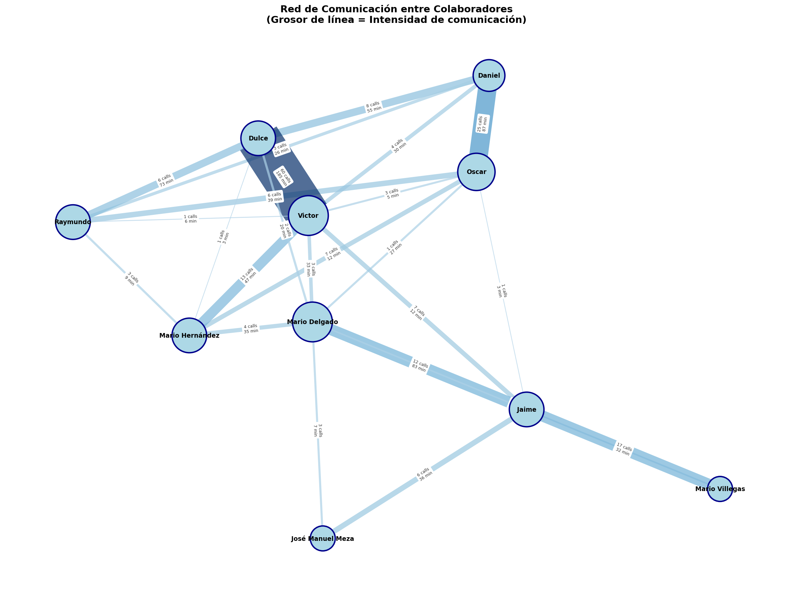

# LlamadasProduccion

Sistema para extraer datos de llamadas telefónicas desde estados de cuenta en PDF y visualizar la comunicación entre colaboradores mediante grafos de red.

## Estructura del Proyecto

```
LlamadasProduccion/
├── PDFs de Estados de Cuenta
│   ├── Jaime 6871200911.pdf          # Estado de cuenta línea 6871200911
│   ├── Mario Delgado 3757560275.pdf  # Estado de cuenta línea 3757560275
│   ├── Mario Samuel 3321831266.pdf   # Estado de cuenta línea 3321831266
│   └── Telcel Unisem.pdf             # Cuenta consolidada múltiples líneas
├── Archivos CSV Generados
│   ├── ConcentradoLlamadas.csv       # Llamadas de 3 líneas individuales
│   ├── TelcelConcentradoLlamadas.csv # Llamadas de cuenta consolidada
│   ├── ConcentradoLlamadasTotal.csv  # Combinación de ambos archivos
│   └── ConcentradoProdInv.csv        # Llamadas con nombres de colaboradores
├── Scripts Python
│   ├── extract_calls.py              # Extracción de PDFs individuales
│   ├── extract_telcel.py             # Extracción de cuenta consolidada
│   └── grafo_comunicacion.py         # Generación de grafo de red
└── Resultados
    └── GrafoComunicacion.png         # Visualización de red de comunicación
```

## Características

- **Extracción de PDFs individuales**: Procesa estados de cuenta de líneas telefónicas individuales
- **Cuenta consolidada**: Maneja múltiples líneas en un solo PDF
- **Filtrado automático**: Excluye llamadas entrantes del análisis
- **Visualización de red**: Genera grafo de comunicación con intensidad representada por grosor de líneas

## Requisitos

```bash
pip install pandas matplotlib networkx
```

## Uso

### Extraer llamadas de PDFs individuales

```bash
python3 extract_calls.py
```

Genera `ConcentradoLlamadas.csv` con llamadas de:
- Jaime (6871200911)
- Mario Delgado (3757560275)
- Mario Samuel (3321831266)

### Extraer llamadas de cuenta consolidada

```bash
python3 extract_telcel.py
```

Genera `TelcelConcentradoLlamadas.csv` con llamadas de múltiples líneas.

### Generar grafo de comunicación

```bash
python3 grafo_comunicacion.py
```

Genera `GrafoComunicacion.png` con la visualización de la red de comunicación.

## Métricas

| Métrica | Valor |
|---------|-------|
| Total llamadas | 198 |
| Colaboradores | 10 |
| Conexiones | 24 |

## Colaboradores Identificados

| Número | Nombre |
|--------|--------|
| 6871200911 | Jaime |
| 3757560275 | Mario Delgado |
| 3321831266 | Mario Hernández |
| 4622209603 | Victor |
| 4622510684 | Dulce |
| 4626213387 | Oscar |
| 4626213388 | Natalio |
| 4615469058 | Daniel |
| 4621032945 | Raymundo |
| 4622201013 | Mario Villegas |

## Formato de Datos

### CSV de Llamadas

```
NumeroOrigen,NumeroDestino,Fecha,Hora,Duracion
6871200911,4622201016,27-Ene,12:38:55,6
```

### CSV con Colaboradores

```
NumOrigen,ColabOrigen,NumDestino,ColabDestino,Fecha,Hora,Duracion
6871200911,Jaime,4622201016,José Manuel Meza,2026-01-27,12:38:55,6
```

## Grafo de Comunicación

El grafo generado muestra:
- **Nodos**: Colaboradores (tamaño proporcional a sus conexiones)
- **Líneas**: Comunicación entre ellos (grosor = intensidad)
- **Peso**: Calculado como `num_llamadas + (duracion_total / 10)`

